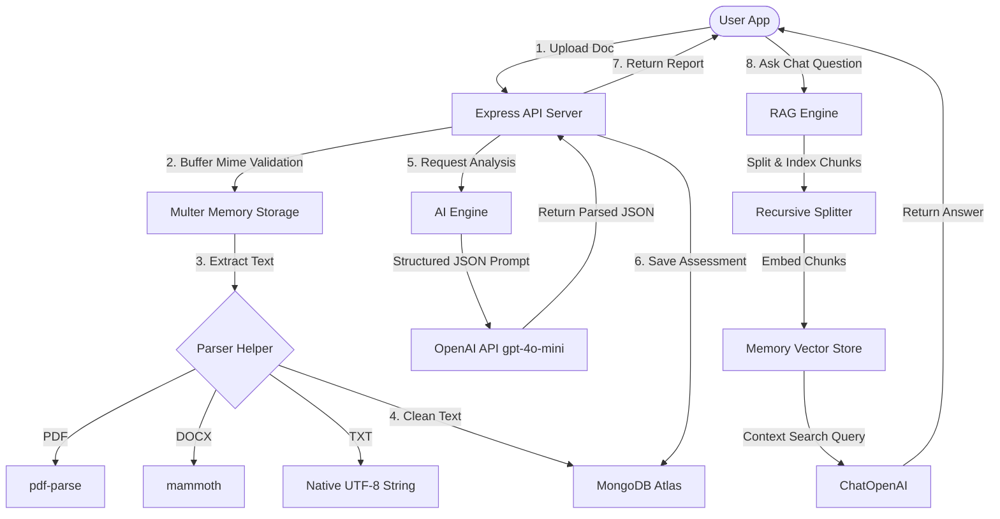

# LexiGuard.ai - AI-Powered Legal Document Analyzer

LexiGuard.ai is a complete, production-ready, full-stack web application designed for modern SaaS document auditing. Users can securely upload legal documents (PDF, DOCX, TXT), extract and clean raw text, execute structured AI-driven risk assessments, and interact with documents in real time using Retrieval-Augmented Generation (RAG) chat. Audit reports can be managed via a dashboard and exported as formatted PDF and DOCX files.

---

## 🛠️ Technology Stack

* **Frontend**: React.js, Vite, Tailwind CSS, Framer Motion, React Router DOM, Axios, jsPDF, docx
* **Backend**: Node.js, Express.js
* **Database**: MongoDB (via Mongoose ODM)
* **AI/LLM**: OpenAI API, LangChain (Recursive Text Splitters, Memory Vector Stores, QA Chains)
* **Document Processing**: `pdf-parse` (for PDF text parsing), `mammoth` (for DOCX extraction)
* **Security & Authentication**: JWT, bcryptjs, Helmet, CORS, Express-Rate-Limit

---

## 📐 System Architecture

Below is the workflow showing the document parsing, analysis, and chat sequences:



---

## 📁 Project Folder Structure

```text
MaMo_Technolabs_task3/
├── backend/
│   ├── config/
│   │   └── db.js                 # MongoDB connection using Mongoose
│   ├── controllers/
│   │   ├── authController.js     # User registration, login, and dashboard statistics
│   │   ├── documentController.js # Document upload, listing, and deletes
│   │   └── analysisController.js # AI analysis runs, histories, and RAG chat
│   ├── middleware/
│   │   ├── authMiddleware.js     # JWT extraction and session protection
│   │   └── uploadMiddleware.js   # Multer file size and type validators
│   ├── models/
│   │   ├── User.js               # User MongoDB Schema
│   │   ├── Document.js           # Document MongoDB Schema
│   │   └── Analysis.js           # Analysis MongoDB Schema
│   ├── routes/
│   │   ├── authRoutes.js         # /api/auth routes
│   │   ├── documentRoutes.js     # /api/documents routes
│   │   └── analysisRoutes.js     # /api/analyze and /api/history routes
│   ├── services/
│   │   ├── aiService.js          # OpenAI Chat completion + Mock fallback analyzer
│   │   └── ragService.js         # LangChain RAG vector queries + keyword fallback
│   ├── utils/
│   │   └── extractor.js          # Text parsers for pdf-parse and mammoth
│   ├── .env                      # Local configuration settings (hidden)
│   ├── .env.example              # Template environment configurations
│   ├── package.json              # Backend package list
│   └── server.js                 # Backend entry point
├── frontend/
│   ├── src/
│   │   ├── components/
│   │   │   ├── Navbar.jsx        # Landing page navigation
│   │   │   ├── Sidebar.jsx       # Workspace sidebar navigation
│   │   │   └── ProtectedRoute.jsx# Auth guard router wrapper
│   │   ├── context/
│   │   │   ├── AuthContext.jsx   # Authentication context & axios interceptor
│   │   │   └── ThemeContext.jsx  # Dark/Light theme toggle
│   │   ├── pages/
│   │   │   ├── LandingPage.jsx   # High-converting marketing landing page
│   │   │   ├── Login.jsx         # Credentials user sign-in page
│   │   │   ├── Register.jsx      # Credentials user sign-up page
│   │   │   ├── Dashboard.jsx     # Stats overview and recent file feeds
│   │   │   ├── UploadDocument.jsx# Drag-and-drop file scanner
│   │   │   ├── AnalysisHistory.jsx# Table grid of past evaluations
│   │   │   ├── UserProfile.jsx   # User details and password updates
│   │   │   └── AnalysisResult.jsx# Interactive analysis and AI chat panel
│   │   ├── utils/
│   │   │   └── exportHelpers.js  # client-side PDF (jsPDF) and DOCX exporters
│   │   ├── App.jsx               # Router mapping
│   │   ├── index.css             # Tailwind rules and styling variables
│   │   └── main.jsx              # React mounting script
│   ├── index.html                # Root SEO markup
│   ├── postcss.config.js         # PostCSS configuration
│   ├── tailwind.config.js        # Tailwind layout theme setups
│   ├── vite.config.js            # Vite build configuration + local dev proxy
│   └── package.json              # Frontend package list
└── README.md                     # Documentation
```

---

## 🗄️ Database Design

We implement three MongoDB schemas utilizing Mongoose validators:

### 1. User Schema (`User.js`)
* `name`: String, required.
* `email`: String, required, unique, pattern checked.
* `password`: String, required (hashed using bcrypt in pre-save hooks).
* `createdAt`: Date, default `Date.now`.

### 2. Document Schema (`Document.js`)
* `userId`: ObjectId referencing `User`, required.
* `fileName`: String, required.
* `fileType`: String, required (e.g. `application/pdf`).
* `fileSize`: Number, required (bytes).
* `rawText`: String, required (cleaned text extracted from file).
* `uploadedAt`: Date, default `Date.now`.

### 3. Analysis Schema (`Analysis.js`)
* `documentId`: ObjectId referencing `Document`, required.
* `userId`: ObjectId referencing `User`, required.
* `summary`: String (executive overview).
* `parties`: Array of Objects `[{ name: String, role: String }]`.
* `dates`: Array of Objects `[{ date: String, label: String, description: String }]` (timeline entries).
* `clauses`: Array of Objects `[{ type: String, description: String, snippet: String, riskLevel: String }]`.
* `obligations`: Array of Objects `[{ party: String, obligation: String }]`.
* `risks`: Array of Objects `[{ title: String, description: String, riskLevel: String }]`.
* `riskScore`: Number (range `0-100` calculated on severity frequencies).
* `complianceInsights`: Array of Strings.
* `recommendations`: Array of Strings.
* `actionItems`: Array of Objects `[{ task: String, checked: Boolean }]` (checklist).
* `createdAt`: Date, default `Date.now`.

---

## 🔌 API Endpoints Reference

### Authentication Routes (`/api/auth`)
* `POST /register`: Registers a new user. Returns user details and JWT.
* `POST /login`: Logins user. Returns user details and JWT.
* `GET /profile`: (Protected) Fetches active profile stats (Total Uploads, Risk count, etc.).
* `PUT /profile`: (Protected) Updates profile user name or resets passwords.

### Document Routes (`/api/documents`)
* `POST /upload`: (Protected) Accepts a single multipart form-data document key named `file`. Extracts text, saves metadata, returns ID.
* `GET /`: (Protected) Lists all documents uploaded by user (excludes heavy `rawText` for quick loading).
* `GET /:id`: (Protected) Retrieves single document details (includes `rawText`).
* `DELETE /:id`: (Protected) Deletes document and cascade-deletes all associated analyses.

### Analysis & Chat Routes (`/api`)
* `POST /analyze`: (Protected) Generates AI report for a given `documentId`. If report already exists, returns cached copy (saving token costs) unless `forceReanalyze: true` is passed.
* `GET /analyze/:id`: (Protected) Fetches single analysis report joined with document details.
* `GET /history`: (Protected) Lists analysis histories for the user.
* `DELETE /history/:id`: (Protected) Deletes single history report.
* `POST /analyze/:id/chat`: (Protected) Accepts `{ question }` and executes a RAG similarity search over document text chunk indices to return context-specific answers.

---

## 🚀 Setup & Local Development Guide

### Prerequisites
* **Node.js**: `>=18.0.0`
* **MongoDB**: A running local instance (`mongodb://127.0.0.1:27017/legal-analyzer`) or a MongoDB Atlas cloud URI.
* **OpenAI API Key**: Required for live AI processing (otherwise the app uses the built-in mock fallback engine).

### Step 1: Clone & Navigate
Ensure the code is placed in your workspace directory.

### Step 2: Configure Server Environments
1. Navigate to `/backend`.
2. Open `.env` and fill in configuration keys:
   ```env
   PORT=5000
   MONGODB_URI=mongodb://127.0.0.1:27017/legal-analyzer
   JWT_SECRET=yoursupersecurejwttokenstring
   OPENAI_API_KEY=sk-proj-YOUR_API_KEY_HERE
   ```

### Step 3: Run the Backend
From the `/backend` folder:
```bash
# Start server in production mode
npm start

# Start server in developer hot-reload mode
npm run dev
```
The server will boot on `http://localhost:5000`.

### Step 4: Run the Frontend
1. Open a new terminal in `/frontend`.
2. Start the Vite React development server:
   ```bash
   npm run dev
   ```
The development app will launch on `http://localhost:5173`. Vite will proxy API requests automatically to `http://localhost:5000` via rules in `vite.config.js`.

---

## ☁️ Deployment Instructions

### 1. Database Setup (MongoDB Atlas)
1. Register for a free tier database at [MongoDB Atlas](https://www.mongodb.com/cloud/atlas).
2. Create a cluster, navigate to **Database Access**, and add a user with read/write credentials.
3. In **Network Access**, whitelist connection IPs (`0.0.0.0/0` for initial cloud deployments).
4. Copy the connection string (e.g., `mongodb+srv://...`) to use as `MONGODB_URI`.

### 2. Backend Deployment (Render or Railway)
#### Render:
1. Create an account at [Render](https://render.com).
2. Connect your GitHub repository.
3. Create a new **Web Service**.
4. Configure settings:
   * **Root Directory**: `backend`
   * **Build Command**: `npm install`
   * **Start Command**: `npm start`
5. In **Environment Variables**, add the keys defined in `.env` (`MONGODB_URI`, `JWT_SECRET`, `OPENAI_API_KEY`).
6. Copy the deployed service URL (e.g., `https://legal-analyzer-api.onrender.com`).

### 3. Frontend Deployment (Vercel)
#### Vercel:
1. Register at [Vercel](https://vercel.com).
2. Select **Add New Project** and connect your repo.
3. Configure the settings:
   * **Framework Preset**: `Vite`
   * **Root Directory**: `frontend`
   * **Build Command**: `npm run build`
   * **Output Directory**: `dist`
4. If deploying the frontend and backend on separate domains (without Vite proxy configuration):
   * Add a `vercel.json` file in `/frontend` or update `axios.defaults.baseURL` to point directly to your deployed backend URL.

---

## 🔒 Production Best Practices

* **Zero Data Retention**: Keep document text in MongoDB, but restrict access. RAG chat vectors are created in-memory and discarded post-session.
* **API Rate Limiting**: The server utilizes `express-rate-limit` to restrict spam (capped at 200 requests per 15 minutes per IP).
* **Security Headers**: `helmet` is active to mask server identities, prevent XSS scripting injections, and restrict iframe Clickjacking.
* **CORS Lockdown**: Update `cors({ origin: 'https://your-frontend.com' })` in `server.js` before deploying to lock down api access.
* **Token Expiration**: JWT tokens expire in 30 days. For enterprise operations, reduce expiration to 1 hour and implement refresh-token cycles.
* **JSON Parsing Fallbacks**: The prompt engine specifies `json_object` format and features secondary string regex matching to prevent parser crashes if responses contain formatting tags.
* **Large Files Handling**: Limit upload buffers to 20MB. Very large text runs are sliced to 40,000 characters before sending to OpenAI to prevent billing/token limit overflows.
